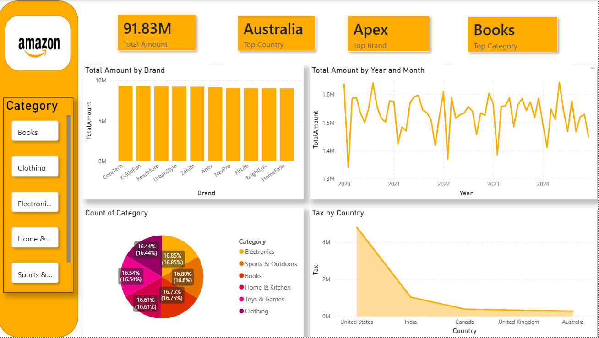

This is an interactive dashboard developed using Power BI to transform raw Amazon Sales Data into clear, actionable business insights.

## Dashboard Preview

## Key Insights & Highlights
* 📊 **Total Sales:** Reached **91.83M**
* 🌍 **Top Country:** **Australia** leads the total sales.
* 🏆 **Top Brand:** **Apex** is the best-performing brand.
* 📚 **Top Category:** **Books** is the most selling category.

## Analysis Focus
- Tracking sales trends across months and years.
- Analyzing country-level performance differences.
- Measuring the impact of taxes on total revenue.
